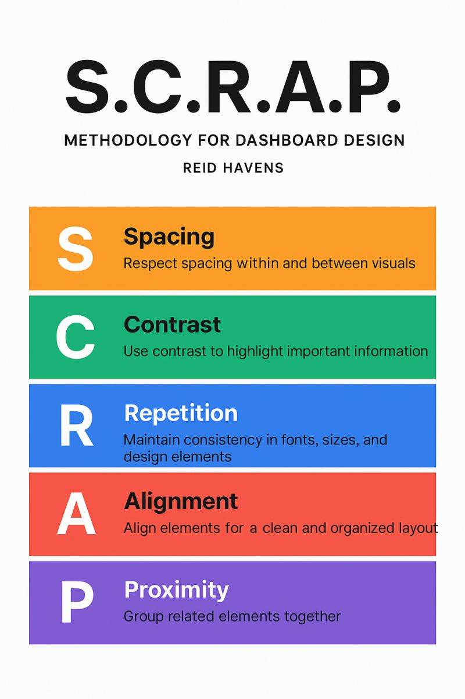

# 📊 Dashboards en Tableau
Un dashboard es una pantalla que reúne varios gráficos en un solo lugar.

Sirve para:

* Mostrar información clave.
* Facilitar decisiones.
* Centralizar datos importantes.

No crea datos nuevos.
Organiza los gráficos existentes.

---

## Qué debe tener un buen dashboard

* Claridad.
* Jerarquía visual.
* Coherencia.
* Un objetivo definido.

👉 Un dashboard es una historia visual, no una colección de gráficos.

---

# 🧠 Antes de crear un dashboard

Antes de empezar, debemos responder:

## 1️⃣ ¿Cuál es el objetivo?

¿Qué queremos analizar o mejorar?

Ejemplo:

* Aumentar ventas.
* Reducir tiempos de respuesta.
* Analizar precios.

---

## 2️⃣ ¿Quién es la audiencia?

No es lo mismo un dashboard para:

* CEO
* Equipo técnico
* Marketing

Cada audiencia necesita métricas diferentes.

---

## 3️⃣ ¿Qué métricas incluir?

* Métricas de resultado (ventas, ingresos).
* Métricas accionables (lo que permite actuar).

Un buen dashboard permite tomar decisiones.

---

# 🎨 Consejos de diseño

* Diseña de izquierda a derecha.
* Coloca lo más importante arriba.
* Usa nombres claros.
* Mantén colores coherentes.
* No mezcles muchos marcos temporales.
* Agrupa métricas relacionadas.
* No satures con información.

👉 Si un dato no aporta valor, elimínalo.

Usa la metodología de diseño de S.C.R.A.P

---

# 📐 Estructura del Dashboard

## Tamaño

Opciones:

* Fijo → Presentaciones.
* Automático → Web.
* Rango → Intermedio.

Recomendación habitual:
1200x800 como base.

---

## 🧩 Objetos: Mosaico vs Flotantes

### Mosaico (Tiled)

* Alineación automática.
* Diseño limpio.
* Mejor para dashboards responsivos.

### Flotantes (Floating)

* Posición libre.
* Permite superponer elementos.
* Más creativo, pero menos estable.

👉 Recomendación: usar mosaico como base y flotantes solo cuando sea necesario.

---

## 📦 Contenedores

Permiten:

* Agrupar elementos.
* Alinear automáticamente.
* Crear secciones organizadas.

Tipos:

* Vertical
* Horizontal

👉 Usar contenedores ayuda a mantener orden.

---

# Crear un Dashboard paso a paso

1. Crear visualizaciones individuales.
2. Crear nuevo dashboard.
3. Definir tamaño.
4. Arrastrar hojas.
5. Organizar con mosaico o flotante.
6. Añadir filtros.
7. Añadir acciones (interactividad).
8. Ajustar estilo.
9. Publicar.

---

# Elementos Visuales en Dashboards

Mejoran navegación, estética y experiencia de usuario.

## 🖼 Imágenes

Sirven para:

* Logos.
* Encabezados.
* Contexto visual.

Se añaden desde:
**Objetos → Imagen**

Recomendación:

* Usar PNG o JPG optimizados.

---

## 🔘 Botones de navegación

Permiten:

* Ir a otra hoja.
* Ir a otro dashboard.
* Crear menús.

Se crean desde:
**Objetos → Botón de navegación**

Útiles para:

* Crear estructura tipo web.
* Añadir botón “volver atrás”.

---

## 👁 Botón mostrar/ocultar

Permite:

* Mostrar filtros avanzados.
* Ocultar paneles.
* Hacer dashboard más limpio.

Pasos:

1. Agrupar elementos en contenedor.
2. Activar "Agregar botón mostrar/ocultar".

---

## 📝 Textos

Sirven para:

* Títulos.
* Subtítulos.
* Instrucciones.

Buenas prácticas:

* Textos breves.
* Claros.
* No saturar.

---
# 🌍 Publicar en Tableau Public

Compartir visualizaciones y construir portfolio. Este bloque tiene doble función:
- Técnica (publicar)
- Profesional (portfolio)
- Plataforma gratuita
- Todo lo que subes es público.

### 📌 Buenas prácticas
- No usar datos sensibles
- Nombrar bien proyectos
- Cuidar el diseño
- Revisar antes de publicar.

> “Publicar es parte del aprendizaje.”
