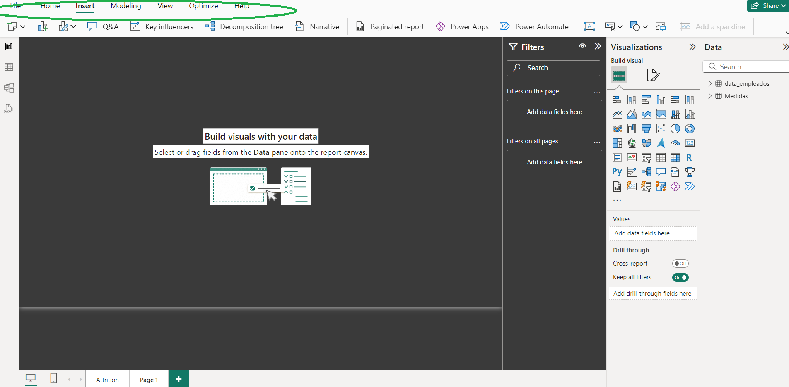
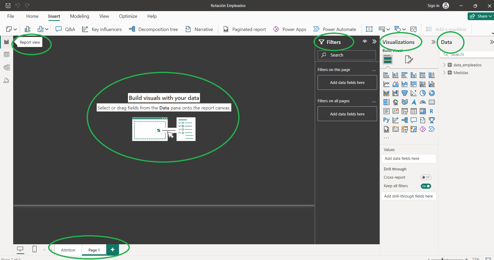
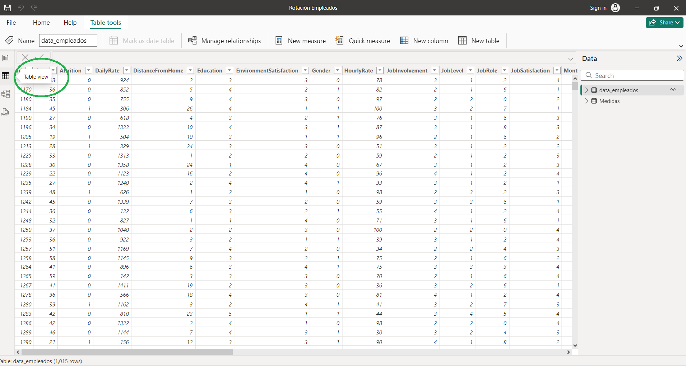
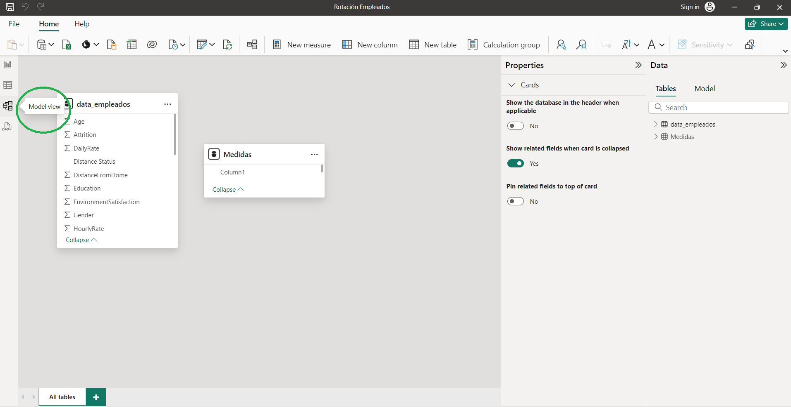
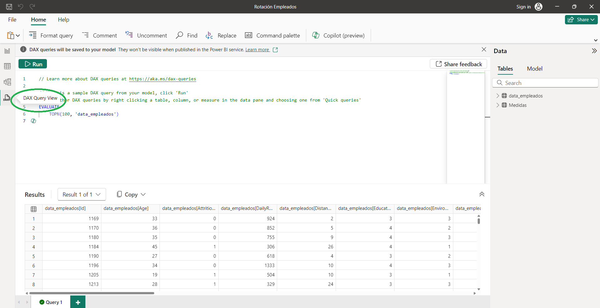

# Interfaz Power BI

En la parte superior de la pantalla:

## Menú

El menú de opciones en la parte superior de Power BI Desktop contiene varias pestañas y botones que proporcionan acceso a diversas funciones y herramientas:

* **Archivo**: Permite abrir, guardar y publicar informes.
* **Inicio**: Contiene opciones para importar datos, transformar datos, crear nuevas visualizaciones, etc.
* **Vista**: Aquí existen opciones para cambiar el diseño de la interfaz, agregar líneas de cuadrícula, y ajustar la visualización de páginas.
* **Modelado**: Proporciona herramientas para crear y gestionar relaciones, medidas calculadas, y columnas calculadas.
* **Insertar**: Permite agregar imágenes, formas, y otros objetos a los informes.

En la parte izquierda de la pantalla:

## Vista de Informe

Esta es la vista principal donde se diseñan los informes y dashboards. Aquí puedes crear y organizar visualizaciones en páginas de informe.

* **Páginas del Informe**: Puedes agregar, eliminar, y navegar entre diferentes páginas del informe.
* **Área de Diseño**: Aquí es donde se arrastran y sueltan visualizaciones, se ajusta su tamaño y posición, y se personaliza su apariencia.
* **Panel de Campos**: Este panel muestra las tablas y columnas de datos disponibles para su uso en visualizaciones. Los datos se organizan por tablas, y cada tabla contiene sus respectivas columnas. Para usar los campos, arrastra y suelta campos en el área de visualización para crear gráficos y otras visualizaciones.
* **Panel de Visualizaciones**: Aquí es donde puedes seleccionar y personalizar los tipos de visualizaciones para tus datos:
  * _Tipos de Visualización_: Contiene iconos para diferentes tipos de gráficos como barras, líneas, pasteles, mapas, etc.
  * _Formatos de Visualización_: Opciones para personalizar el diseño, colores, y otros aspectos de las visualizaciones.
  * _Datos y Campos_: Áreas donde puedes arrastrar campos para definir ejes, valores, leyendas, y otras propiedades de las visualizaciones.
* **Panel de Filtros**: Aquí podremos aplicar filtros a los datos para restringir las visualizaciones a ciertos valores o rangos:
  * _Filtros de Nivel de Página_: Afectan todas las visualizaciones en una página específica.
  * _Filtros de Nivel de Informe_: Afectan todas las visualizaciones en todas las páginas del informe.
  * _Filtros de Nivel de Visualización_: Afectan solo una visualización específica.

## Vista de Datos

Aquí vamos a poder ver y explorar los datos subyacentes de las tablas y columnas con las que estemos trabajando. Las dos operaciones principales que podemos realizar aquí son:

* **Ver Tablas de Datos**: Muestra los datos importados en formato tabular.
* **Transformar Datos**: Puedes realizar transformaciones y limpieza de datos en esta vista.

## Vista de Modelo

En esta vista, se muestra un diagrama de las relaciones entre las tablas de datos. Aquí podemos crear y gestionar relaciones entre tablas:

* **Creación de Relaciones**: Arrastra y suelta para crear relaciones entre tablas.
* **Gestión de Relaciones**: Configura propiedades y cardinalidades de las relaciones.

## Vista de DAX Query

Esta vista la podremos encontrar en las últimas versiones de la herramienta. Para los usuarios avanzados y desarrolladores, la capacidad de analizar y optimizar las consultas DAX (Data Analysis Expressions) es esencial. La "DAX Query View" en Power BI Desktop permite a los usuarios ver y analizar las consultas DAX que el motor de Power BI genera y ejecuta. Aprenderemos un poco más de DAX al final de las lecciones.

