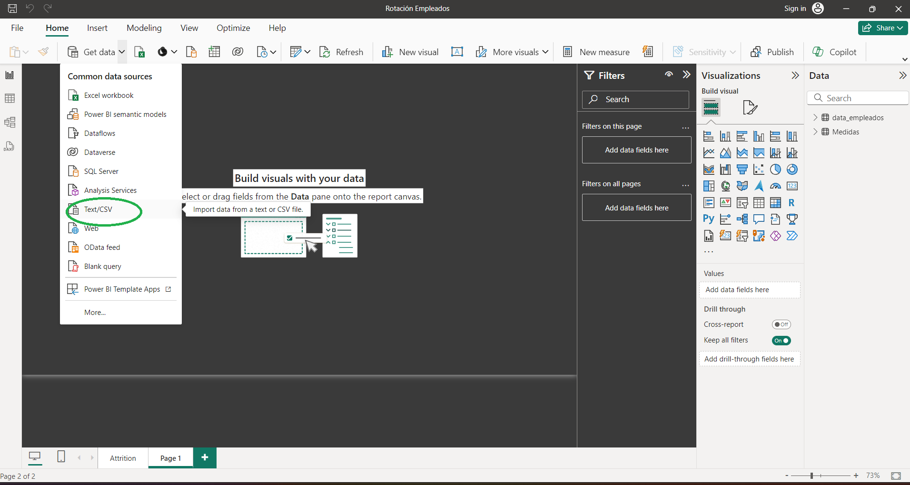
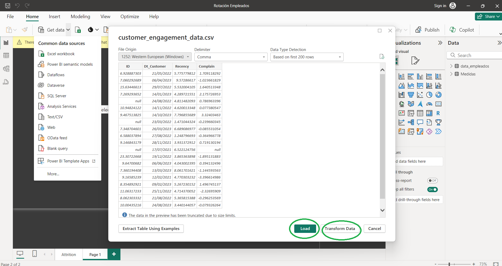
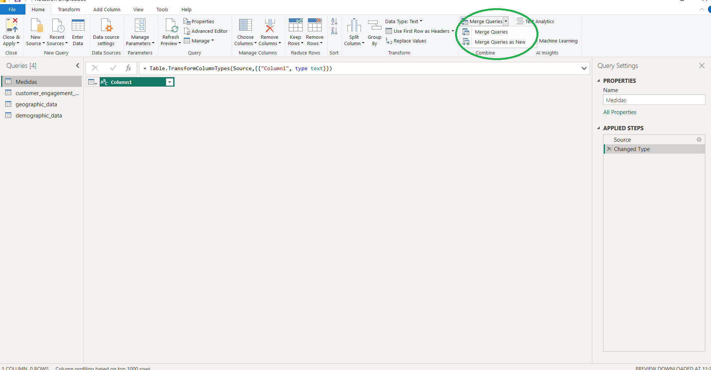
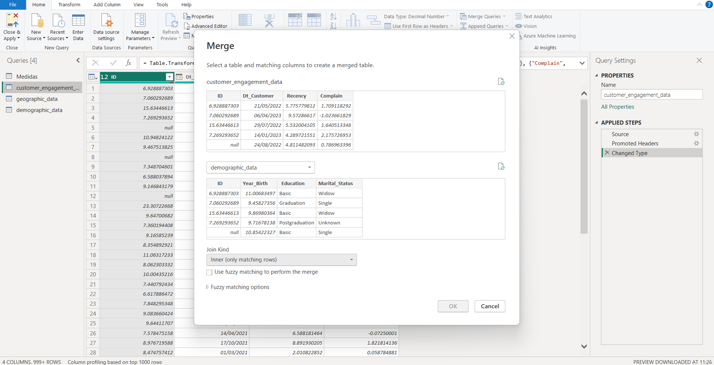
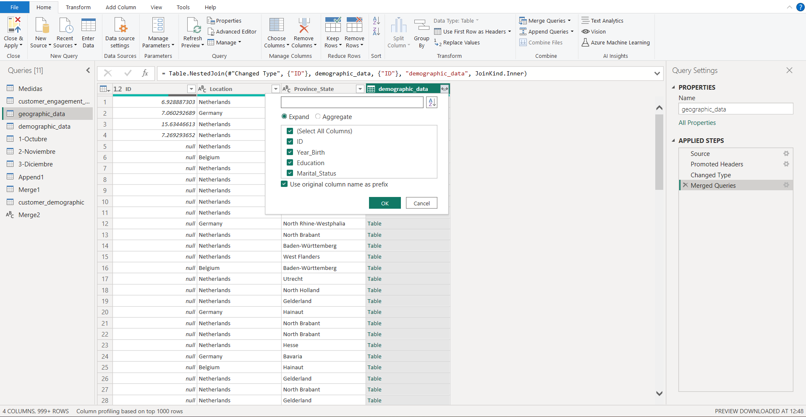
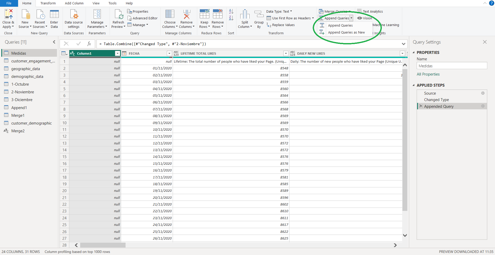
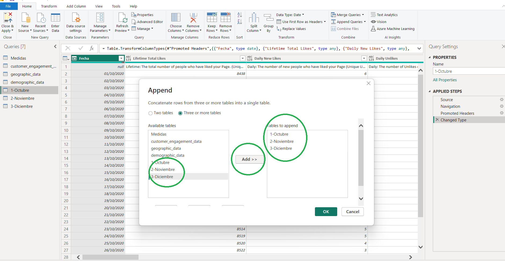

## Conexión de Ficheros

Power BI permite conectarse a una amplia variedad de ficheros para importar datos, desde ficheros locales en tu ordenador a ficheros almacenados en servicios en la nube.

A continuación, vamos a ver los pasos para **conectar ficheros** de datos de los formatos más frecuentes (Excel, CSV o Texto):

* Abre Power BI Desktop.
* En la pestaña _Inicio_, selecciona _Obtener datos > Archivo > Excel_ (para archivos Excel) u _Obtener datos > Archivo > Texto/CSV_ (para ficheros CSV o Texto).
* Navega hasta el archivo Excel que deseas conectar y selecciónalo.
* En el cuadro de diálogo de navegación, selecciona las hojas o tablas que deseas importar.
*   Selecciona _Cargar_ para importar los datos directamente o _Transformar_ datos para abrir el Editor de Power Query y realizar transformaciones antes de cargar.

    

    

### Combinación de Ficheros

Combinar ficheros por columnas en Power BI Desktop se puede hacer utilizando la función de combinación (merge) en el Editor de Power Query. Esta función es útil cuando se desea unir datos de diferentes tablas basadas en una o más columnas comunes (claves). A continuación, puedes ver los pasos necesarios:

* Abre Power BI Desktop:
* Haz clic en el botón Obtener datos en la pestaña Inicio.
* Selecciona la fuente de datos correspondiente (por ejemplo, Excel, CSV, etc.).
* Carga todos los ficheros que quieres combinar.
* Abre el Editor de Power Query.
* Después de cargar los datos, ve a la pestaña _Inicio_ y selecciona _Transformar datos_. Esto abrirá el Editor de Power Query.
*   Haz click en combinar Consultas (Merge Queries). Selecciona Combinar consultas (si deseas combinar en la consulta actual) o Combinar consultas como nuevas (si deseas crear una nueva tabla combinada).

    
* En Power Query Editor, selecciona una de las tablas que deseas combinar.
* En el cuadro de diálogo de combinación, selecciona la segunda tabla que deseas combinar.
* Selecciona las columnas clave en ambas tablas que se utilizarán para la unión.
* Elige el tipo de unión (Inner Join, Left Outer Join, Right Outer Join, Full Outer Join, etc.) según tus necesidades.
*   Haz clic en Aceptar.

    
* Después de combinar, la tabla combinada aparecerá con una columna que representa la tabla combinada. Haz click en el ícono de expansión (un pequeño icono de doble flecha) en el encabezado de la columna combinada y selecciona las columnas que deseas incluir en la tabla combinada.
* Haz click en Aceptar.
*   Renombra la consulta.

    

### Concatenación de Ficheros

En ocasiones, nos interesa más unir fuentes de datos combinando las filas. Concatenar ficheros en Power BI Desktop significa unir varias tablas (o consultas) con la misma estructura (es decir, las mismas columnas) en una sola tabla. Este proceso se llama "anexar" consultas en Power Query. Esta técnica es especialmente útil cuando trabajas con datos de series temporales o datos distribuidos en múltiples archivos que necesitan ser combinados en una única vista para análisis.

A continuación, puedes ver los pasos necesarios para concatenar varios ficheros:

* Haz click en el botón Obtener datos en la pestaña Inicio.
* Selecciona la fuente de datos correspondiente (por ejemplo, Excel, CSV, etc.).
* Carga todos los ficheros que quieres concatenar.
* Abre el Editor de Power Query.
* Después de cargar los datos, ve a la pestaña Inicio y selecciona Transformar datos. Esto abrirá el Editor de Power Query.
*   Haz click en Concatenar Consultas (Append Queries). Puedes elegir Anexar consultas para añadir datos a la consulta actual o Anexar consultas como nuevas para crear una nueva tabla con los datos combinados.

    
*   Selecciona las tablas que quieres concatenar.

    
* Haz clic en Aceptar.
* Renombra la consulta.
