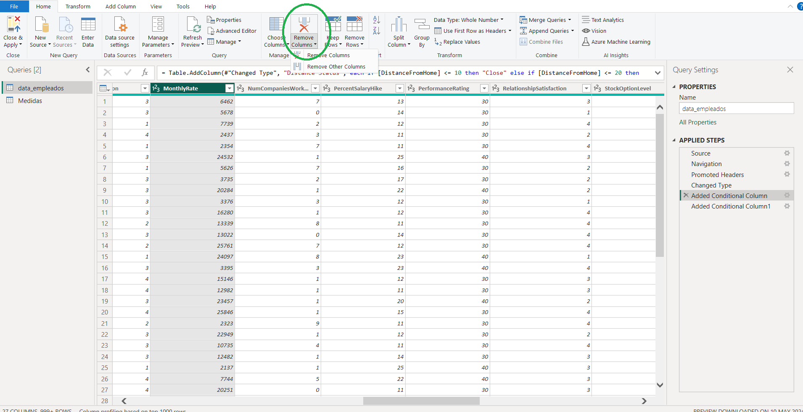
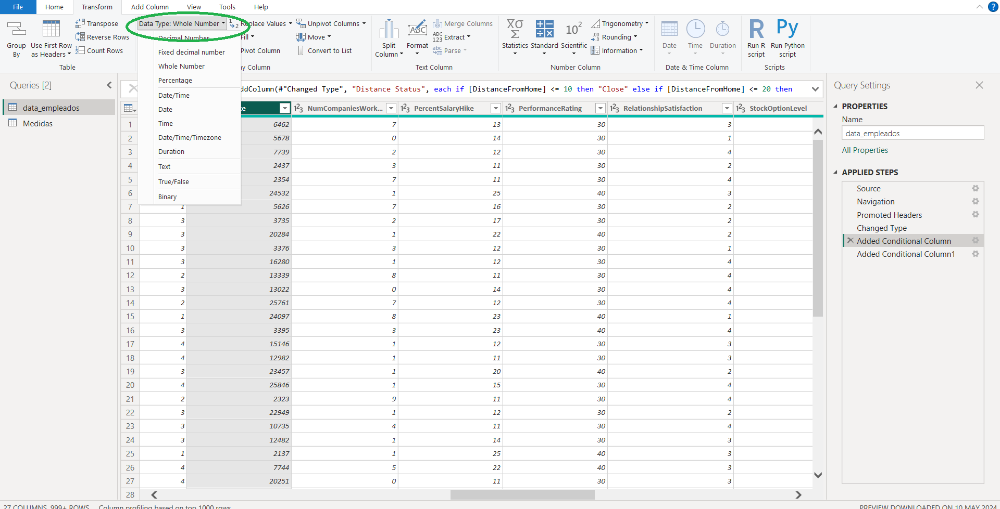
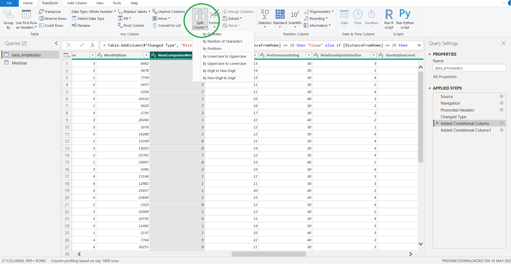
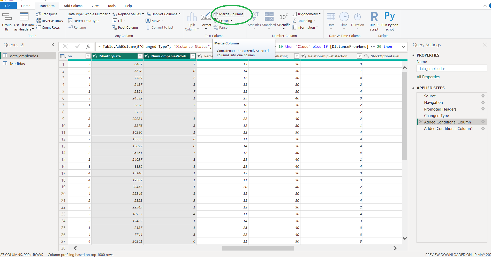
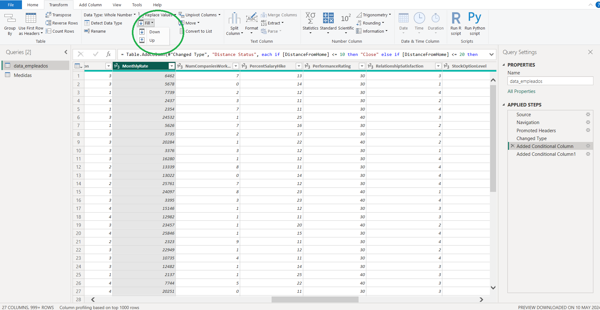
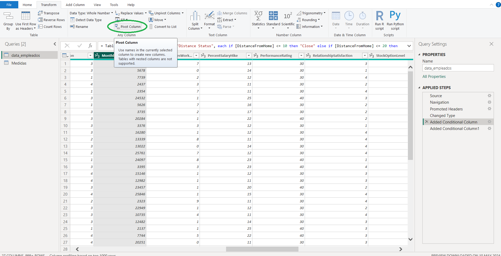
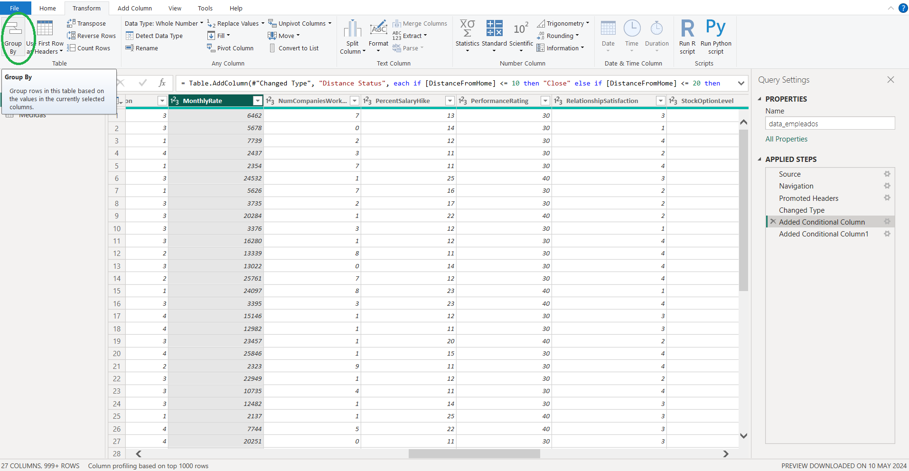
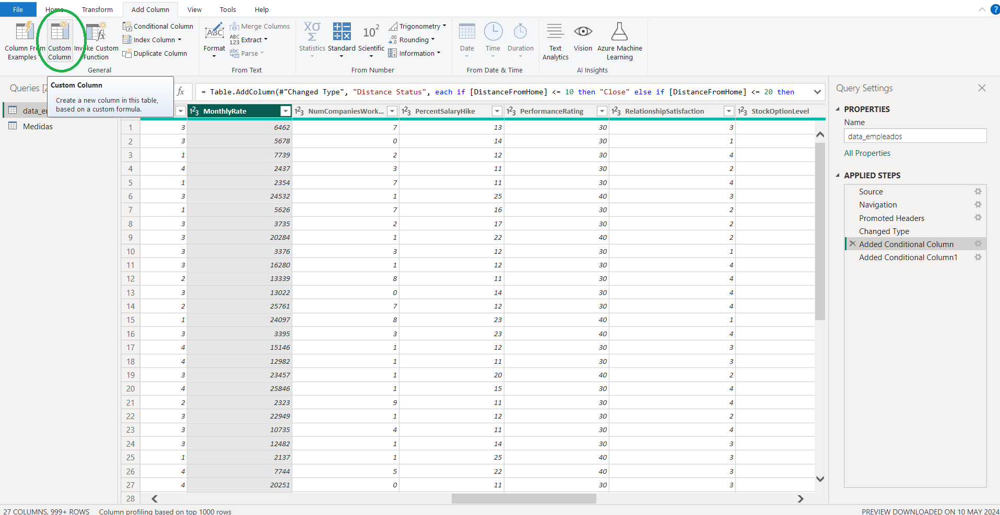
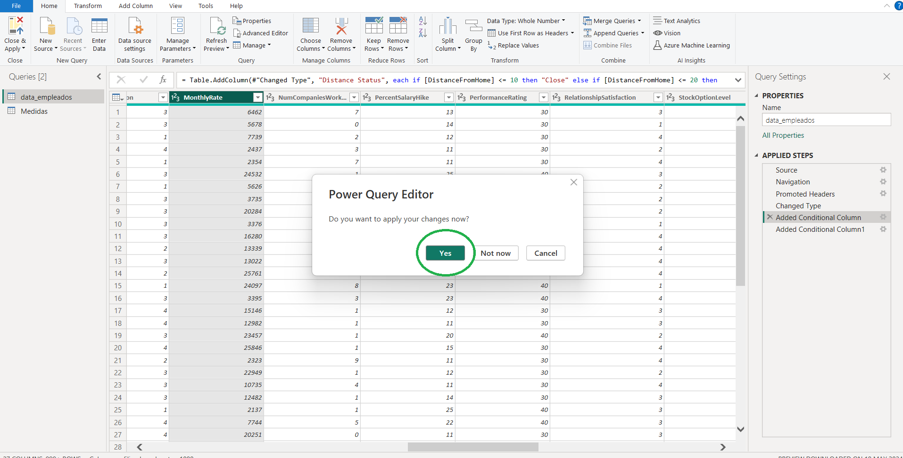

# Transformación de Datos

Transformar datos es un paso crucial en el proceso de análisis, ya que permite limpiar y organizar los datos para obtener información precisa y significativa. En Power BI, la transformación de datos se realiza principalmente en el **Editor de Power Query**.

Los datos rara vez vienen listos para ser analizados. Suelen contener errores, valores nulos, formatos inconsistentes o estar distribuidos en varias tablas. La transformación permite:

* Homogeneizar y limpiar los datos.
* Prepararlos para visualizaciones más efectivas.
* Reducir el riesgo de análisis incorrectos.
* Optimizar el rendimiento del modelo.

### Acceso al Editor de Power Query

* Abre _Power BI Desktop_.
* En la pestaña _Inicio_, selecciona _Transformar datos_.

### Navegación por el Editor de Power Query

* **Menú**: Contiene herramientas y comandos para transformar datos.
* **Panel de Consultas**: Muestra las consultas disponibles.
* **Área de Datos**: Muestra una vista previa de los datos.
* **Panel de Pasos Aplicados**: Muestra los pasos de transformación aplicados a los datos.

***

### Transformaciones Básicas de Datos

#### 1. Filtrado de Filas

El filtrado permite trabajar solo con los datos relevantes. Puedes eliminar registros duplicados, incompletos o innecesarios.

**Cómo hacerlo:**

* Selecciona la columna por la cual deseas filtrar.
* En la barra de menú, selecciona _Reducir filas > Quitar filas_ o _Mantener filas_.

**Por ejemplo:** Filtrar solo los pedidos que superen los 100 € para un análisis de ventas de alto valor.

#### 2. Eliminación de Columnas

Las columnas innecesarias dificultan la lectura, aumentan el tamaño del archivo y pueden reducir el rendimiento del informe.

**Cómo hacerlo:**

* Selecciona las columnas que deseas eliminar.
* En la barra de menú, selecciona _Quitar columnas_.

**Por ejemplo:** Eliminar columnas como dirección o teléfono cuando se desea analizar solo información de productos vendidos.

#### 3. Cambio de Tipo de Datos

Es fundamental tener tipos de datos correctos (texto, número, fecha) para realizar cálculos, comparaciones o visualizaciones correctas.

**Cómo hacerlo:**

* Selecciona la columna.
* En la barra de menú, selecciona _Transformar > Tipo de datos_.

**Por ejemplo:** Cambiar una columna de fecha importada como texto al tipo "Fecha" para poder calcular diferencias de tiempo.

#### 4. Dividir Columnas

Sirve para extraer información útil de campos combinados, como separar nombre y apellido o ciudad y código postal.

**Cómo hacerlo:**

* Selecciona la columna.
* Selecciona _Dividir columna_ por delimitador o número de caracteres.

**Por ejemplo:** Dividir "Madrid, España" en dos columnas: una para ciudad y otra para país.

#### 5. Combinar Columnas

Útil para crear identificadores únicos o resumir información.

**Cómo hacerlo:**

* Selecciona varias columnas.
* Elige _Transformar > Combinar columnas_.

**Por ejemplo:** Unir el nombre y el apellido en una nueva columna llamada "Nombre completo".

#### 6. Rellenar Valores Nulos

Algunos conjuntos de datos están estructurados en forma jerárquica, y rellenar los valores nulos permite conservar contexto sin repetir datos.

**Cómo hacerlo:**

* Selecciona la columna.
* _Transformar > Rellenar > Hacia arriba / Hacia abajo_.

**Por ejemplo:** En una tabla donde los nombres de categoría aparecen solo una vez por grupo, rellenar los espacios vacíos con el valor superior.

#### 7. Pivotar y Despivotar Columnas

Para transformar datos entre formatos largos y anchos. Ideal para reorganizar datos según métricas o dimensiones.

* **Pivotar**: convierte valores únicos en nombres de columna.
* **Despivotar**: convierte columnas en filas.

**Por ejemplo:** Pivotar una tabla de ventas donde las filas contienen años y los valores se convierten en columnas por cada año.

#### 8. Agrupar por

Permite resumir datos agregando valores (suma, promedio, conteo) por categorías.

**Cómo hacerlo:**

* Selecciona una columna.
* Ve a _Transformar > Agrupar por_.

**Por ejemplo:** Agrupar ventas por cliente para obtener el total facturado a cada uno.

#### 9. Crear Columnas Personalizadas

Cuando las transformaciones automáticas no bastan, puedes crear fórmulas M para calcular nuevos valores.

**Cómo hacerlo:**

* _Agregar columna > Columna personalizada_.
* Escribe la fórmula necesaria.

**Por ejemplo:** Crear una columna que calcule el precio con IVA a partir del precio base.

#### 10. Aplicar Transformaciones y Cargar Datos

Una vez preparadas las transformaciones, debes cargarlas al modelo para visualizarlas y analizarlas.

**Cómo hacerlo:**

* Haz clic en _Cerrar y aplicar_.

**Por ejemplo:** Después de limpiar y combinar todas las tablas necesarias, aplicar cambios para construir un dashboard de ventas por zona.

***

### Otras Transformaciones Clave en Power BI

#### 📂 Reemplazar valores

Corrige errores comunes, abreviaciones o valores inconsistentes que dificultan el análisis.

**Ejemplo:** "n.a." → "No disponible"

**Por ejemplo:** Reemplazar distintos formatos de respuesta como "Sí", "si", "sí" por un valor homogéneo "Sí".

**Cómo hacerlo:**

* Clic derecho > _Reemplazar valores_.

***

#### 🤢 Extraer texto

Extraer partes útiles de un string, como códigos, dominios, iniciales, etc.

**Opciones comunes:** primeros caracteres, delimitadores, texto entre posiciones.

**Ejemplo:** Extraer el dominio de un correo electrónico para segmentar por empresa.

**Por ejemplo:** De "1234-ABCD" extraer solo el código "ABCD" para identificar producto.

***

#### 🔢 Columna condicional

Crea nuevas variables según reglas lógicas para categorizar datos.

**Ejemplo:** Si Ventas > 1000 → "Alto", si no → "Bajo".

**Por ejemplo:** Clasificar una columna de edad en grupos: "Joven" (menor de 30), "Adulto" (30-59), "Senior" (60 o más).

**Cómo hacerlo:** _Agregar columna > Columna condicional_.

***

#### 🔍 Filtrado de datos

Para eliminar registros irrelevantes, mantener calidad y relevancia en el análisis.

**Tipos de filtro:** texto (contiene, empieza por), número, fecha.

**Por ejemplo:** Filtrar todas las filas donde el país sea "España" y el año sea mayor a 2020.

***

#### 👥 Unir tablas (Merge)

Esencial para combinar múltiples fuentes de información (por ejemplo, ventas + detalles del cliente).

**Cómo hacerlo:** _Inicio > Combinar consultas_.

**Por ejemplo:** Unir la tabla de empleados con la de departamentos para incluir el nombre del departamento en cada registro de empleado.

***

#### 🌍 Funciones geográficas

Clasifica correctamente datos espaciales para visualizarlos en mapas.

**Cómo hacerlo:** _Modelado > Categoría de datos > Provincia, País, etc._

**Por ejemplo:** Etiquetar una columna de códigos postales como "Código postal" para usarla en un mapa de calor por regiones.

***

#### 🗓 Trabajar con fechas

Las fechas permiten crear visualizaciones temporales (líneas de tiempo, calendarios fiscales, etc.).

**Transformaciones útiles:** extraer año, trimestre, calcular duración entre fechas, clasificar por día de semana.

**Por ejemplo:** Crear una nueva columna que indique si una fecha corresponde a un día laborable o fin de semana.

***

#### 🌐 Web Scraping con Power BI

Cargar datos actualizados desde internet sin necesidad de exportarlos manualmente.

**Cómo hacerlo:** _Obtener datos > Web > Insertar URL_. Elige la tabla detectada.

**Limitación:** Solo funciona bien con tablas HTML simples (como Wikipedia).

**Por ejemplo:** Importar desde Wikipedia una tabla con el PIB por país para realizar un análisis económico regional.
