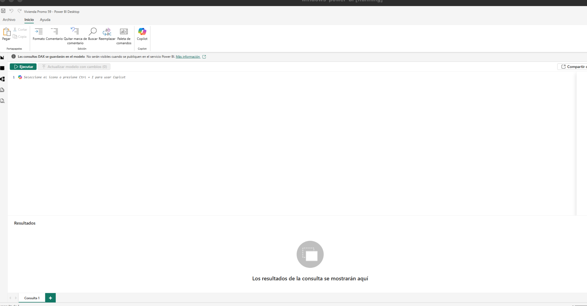

# 📊 MÓDULO 4 – LECCIÓN 10 Power BI Avanzado 
---

# 🧠 1️⃣ DAX (Data Analysis Expressions)

DAX es el lenguaje de fórmulas de Power BI y permite crear cálculos dinámicos dentro del modelo. Se usa para:
* Crear **medidas personalizadas**
* Construir **columnas calculadas**
* Modificar el contexto de filtro (`CALCULATE`)
* Crear **KPIs dinámicos**
* Realizar análisis temporal (YTD, YoY)

## 🔑 Funciones clave

* Agregación → `SUMX`, `DISTINCTCOUNT`, `RANKX`
* Contexto → `CALCULATE`, `ALL`
* Lógicas → `IF`, `SWITCH`
* Tiempo → `DATEADD`, `SAMEPERIODLASTYEAR`
* Relaciones → `RELATED`, `LOOKUPVALUE`

### Vista de consultas de DAX: 



Vista de consultas DAX (DAX Query View), una de las funciones más potentes y recientes de Power BI Desktop.

A diferencia de cuando creas una medida o una columna (donde solo escribes una línea de código), este espacio es un laboratorio de pruebas. Aquí puedes escribir consultas para ver los datos de tus tablas en tiempo real sin necesidad de crear visualizaciones.


Lo que ves en la imagen es la **Vista de consultas DAX** (DAX Query View), una de las funciones más potentes y recientes de Power BI Desktop.

A diferencia de cuando creas una medida o una columna (donde solo escribes una línea de código), este espacio es un **laboratorio de pruebas**. Aquí puedes escribir consultas para ver los datos de tus tablas en tiempo real sin necesidad de crear visualizaciones.

### ¿Para qué sirve principalmente?

1.  **Explorar tus datos rápidamente:** Puedes ver el contenido de una tabla o el resultado de un filtro complejo al instante.
2.  **Probar medidas antes de crearlas:** Puedes verificar si una fórmula de cálculo da el resultado correcto antes de guardarla en tu modelo.
3.  **Optimización:** Ayuda a entender cómo Power BI está procesando los datos.
4.  **Copilot:** Como ves en tu pantalla, puedes usar IA para pedirle que te escriba consultas o te explique fórmulas.

---

### Ejemplos de uso (Copia y pega estos códigos para probar)

Para que funcione en esta ventana, las consultas siempre deben empezar con la palabra **`EVALUATE`**.

#### Ejemplo 1: Ver toda tu tabla de Calendario
Si quieres revisar si tu tabla calendario se creó bien con todos sus campos:
```dax
EVALUATE
'Calendario'
```

#### Ejemplo 2: Ver solo las ventas de un año específico
Si quieres filtrar tu tabla `Compraventa` para ver solo lo que pasó en 2023:
```dax
EVALUATE
FILTER(
    'Compraventa',
    YEAR('Compraventa'[Fecha]) = 2023
)
```

#### Ejemplo 3: Crear una tabla resumen al vuelo
Imagina que quieres ver cuánto se ha vendido por cada Trimestre (Q) sin hacer un gráfico:
```dax
EVALUATE
SUMMARIZECOLUMNS(
    'Calendario'[Trimestre],
    "Total Ventas", SUM('Compraventa'[Importe]) -- Cambia [Importe] por tu columna de valor
)
ORDER BY 'Calendario'[Trimestre] ASC
```

#### Ejemplo 4: Probar una medida compleja
Si quieres calcular el promedio de ventas pero solo de los fines de semana:
```dax
EVALUATE
CALCULATETABLE(
    'Compraventa',
    'Calendario'[DiaSemanaNro] IN {6, 7}
)
```
--- 

# Donde crear medidas, columnas y tablas

### 1. Nueva Medida (Lo más común)
Las **medidas** son para cálculos que cambian según los filtros que apliques en tus gráficos (como sumas, promedios, comparaciones con el año pasado). No crean datos "físicos" en la tabla, sino que se calculan en el momento.

*   **Dónde:** Haz clic derecho sobre cualquier tabla en el panel de **Datos** (a la derecha) y selecciona **Nueva medida**.
*   **Ejemplo:** Aquí es donde pondrías el cálculo de las compraventas:
    ```dax
    Total Compraventas = SUM('Compraventa'[Total])
    ```
*   **Icono:** Aparecerá con un icono de una **calculadora** pequeña.

### 2. Nueva Columna Calculada
Las **columnas** se calculan fila por fila y se guardan en la memoria de tu modelo. Se usan para crear nuevas categorías, etiquetas o para usar en los ejes de tus gráficos (como el "Año", "Mes" o "Trimestre").

*   **Dónde:** En la pestaña **Inicio** o **Modelado**, haz clic en **Nueva columna**.
*   **Ejemplo:** Si quieres saber si una fila de `valor_m2_provincias` es cara o barata:
    ```dax
    Rango Precio = IF('valor_m2_provincias'[Valor_Tasado_€_m2] > 2000, "Caro", "Barato")
    ```
*   **Icono:** Aparecerá con un icono de una **tabla con una columna resaltada**.

### 3. Nueva Tabla
Esto se usa para crear tablas independientes, como la tabla **Calendario** que ya hiciste.

*   **Dónde:** Ve a la pestaña **Modelado** y haz clic en **Nueva tabla**.
*   **Ejemplo:** Tu tabla calendario:
    ```dax
    Calendario = CALENDAR(MIN('Compraventa'[Fecha]), MAX('Compraventa'[Fecha]))
    ```
### ¿Cuál elegir?

| Si quieres... | Usa... | ¿Dónde se ve? |
| :--- | :--- | :--- |
| Sumar, promediar o comparar valores (KPIs) | **Nueva Medida** | Solo en los gráficos (no se ve en la tabla de datos) |
| Crear un filtro nuevo o una categoría fija | **Nueva Columna** | Se ve como una columna más en tu tabla de datos |
| Crear una tabla de fechas o una tabla resumen | **Nueva Tabla** | Aparece como una tabla nueva en tu lista de tablas |

---

# 📅 2️⃣ Tablas de Calendario

Imprescindibles para trabajar con fechas.  ¿Por qué?

Sin calendario:

* No funcionan correctamente `TOTALYTD`, `DATEADD`, `SAMEPERIODLASTYEAR`.
* No se pueden hacer comparaciones interanuales fiables.

## Buenas prácticas

✅ Un único calendario
✅ Marcar como “Tabla de fechas”
✅ Incluir Año, Mes, NúmeroMes, Trimestre
✅ Ordenar Mes por NúmeroMes

🎯 Es la base de cualquier análisis temporal serio.

### Crear un calendario con DAX

1. Crear una nueva tabla
2. Copiar la siguiente fórmula, ajustando el rango de fechas según tus datos:

```dax

Calendario = CALENDAR( MIN('Compraventa'[Fecha]), MAX('Compraventa'[Fecha]) )
```
3. Agregar columnas adicionales para Año, Mes, NúmeroMes, etc.

```dax
Calendario =
ADDCOLUMNS(
    CALENDAR( MIN('Compraventa'[Fecha]), MAX('Compraventa'[Fecha]) ),
    "Año_2", YEAR([Date]),
    "Mes_2", FORMAT([Date], "MMMM"),
    "NúmeroMes", MONTH([Date]),
    "Trimestre", "Q" & FORMAT([Date], "Q")
)   
```

> Otra forma de crear trimestres es usando `QUARTER()`: 
````
"Trimestre", "T" & QUARTER([Date])
````


---

# 🔗 3️⃣ Unión y Relaciones entre Tablas


Un modelo bien diseñado mejora rendimiento y claridad.

## Opciones

1️⃣ Relaciones en modelo (1:N recomendable)
2️⃣ Power Query (joins físicos)
3️⃣ DAX (`RELATED`, `UNION`)

## Recomendación

Modelo en estrella (Dimensiones + Tabla de hechos).

⚠️ Evitar relaciones muchos a muchos innecesarias.

---

# 📊 4️⃣ Ordenar Ejes


Un mal orden puede romper la narrativa visual.

Ejemplo típico:
Meses ordenados alfabéticamente ❌
Solución → “Ordenar por columna” usando NúmeroMes ✔

🎯 El orden debe reforzar la historia que cuentan los datos.

---

# 🎯 5️⃣ Gráfico de Velocímetro


Ideal para mostrar progreso frente a un objetivo.

## Cuándo usarlo

* Cumplimiento de ventas
* Nivel de presupuesto
* % alcanzado

## Componentes

* Valor actual
* Valor mínimo
* Valor máximo
* Valor objetivo

⚠️ No usarlo para comparar muchas categorías.

## Pasos para crear un velocímetro
1. Crear una medida para el valor actual (ej. ventas totales).
```dax
ventas_totales = CALCULATE(SUM(Compraventa[Total Vendido]), ALL(Compraventa)) 
```

2. Crear medidas para el mínimo (ej. 0), máximo (ej. objetivo) y objetivo (ej. 100,000).

```dax
num_años = CALCULATE(DISTINCTCOUNT(Calendario[Año]), ALL(Calendario))

media_ventas = Compraventa[ventas_totales]/[num_años] 
```

3. Insertar el visual de velocímetro y asignar las medidas a cada campo correspondiente.


---

# 📈 6️⃣ KPIs en Power BI

Un **KPI (Key Performance Indicator)** es un indicador clave que mide el rendimiento frente a un objetivo.

## El visual de KPI muestra:

* Valor actual
* Valor objetivo o comparación
* Dirección visual (flecha o color)
* Tendencia temporal

## 🔹 Requisitos para que funcione

Necesitas:

✅ Una **medida DAX principal**
✅ Una **medida de comparación** (objetivo o año anterior)
✅ Una **columna de fecha** en el eje de tendencia (obligatoria)

### 1. Asegura la relación con la tabla Calendario

En la **Vista de modelo**:

1. Arrastra `Calendario[Date]` → `Compraventa[Fecha]` (o la columna de fecha que estés usando).
2. Confirma que la relación es **1:* (uno a muchos)** y está **activa (línea sólida)**.

Sin esto, los filtros de año no funcionarán bien.

### 2. Medida base: viviendas vendidas

Supongo que en `Compraventa` tienes una columna `Total` con número de compraventas de viviendas por periodo (si se llama distinto, cámbialo en la fórmula).

Crea una **medida** en la tabla `Compraventa`:

```dax
Viviendas Vendidas =
SUM( 'Compraventa'[Total] )
```

Esta es la cifra que representará el número de operaciones de compraventa.

### 3. Medida: viviendas vendidas año anterior

Crea otra medida:

```dax
Viviendas Vendidas Año Anterior =
CALCULATE(
    [Viviendas Vendidas],
    SAMEPERIODLASTYEAR( 'Calendario'[Date] )
)
```

- Si en el gráfico filtras por 2024, esta medida devolverá lo vendido en **2023** para el mismo periodo (mes, trimestre, etc.).


### 5. Crear el gráfico para comparar con el año anterior

1. Es el icono que tiene un símbolo de tendencia (una flecha hacia arriba) y un número. Está en la cuarta fila, el segundo empezando por la derecha.
2. Para qué sirve: Te da el número grande (valor actual), una gráfica de fondo (tendencia) y te dice en rojo o verde si has mejorado respecto al año anterior.
3. Dónde poner los campos:
    - Indicador: Tu medida [Viviendas Vendidas].
    - Eje de tendencia: Calendario[Mes] o Calendario[Date].
    - Destino del objetivo: Tu medida [Viviendas Vendidas Año Anterior].

### 6. Añadir filtro por Año

1. Inserta un **segmentador de datos** (Slicer).
2. Arrastra `Calendario[Año]` al segmentador.
3. Ahora, al elegir 2024, por ejemplo:
   - `[Viviendas Vendidas]` mostrará 2024.
   - `[Viviendas Vendidas Año Anterior]` mostrará 2023.
   - El gráfico/ KPI se actualizará automáticamente.


---

## 🔹 Buenas prácticas

✅ Usar colores semánticos (verde, rojo)
✅ Comparar siempre con algo (objetivo o año anterior)
✅ No saturar la página con demasiados KPIs
✅ Agrupar KPIs relacionados

🎯 El KPI no es solo un número: debe contar una historia de rendimiento.

---

# 🆚 7️⃣ Power BI vs Tableau


| Power BI              | Tableau                             |
| --------------------- | ----------------------------------- |
| Más accesible         | Más personalizable                  |
| Integración Microsoft | Motor gráfico más potente           |
| Más económico         | Mejor para análisis visual avanzado |

